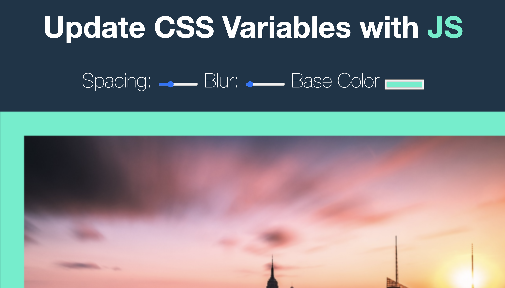

# CSS_variable_with_JS

This is a 30-days javascript grinding  
js30 [https://github.com/ningh98/js30]    
3. CSS variable with JS [https://github.com/ningh98/CSS_variable_with_JS]

## Table of contents

- [Overview](#overview)
  - [Screenshot](#screenshot)
  - [Links](#links)
- [My process](#my-process)
  - [Built with](#built-with)
  - [What I learned](#what-i-learned)


## Overview

The provided code demonstrates how to dynamically update CSS variables using JavaScript. The HTML includes a range input for spacing and blur, and a color input for the base color, which are used to control the styles of an image and a highlighted text span

### Screenshot



### Links

- Live Site URL: [https://ningh98.github.io/CSS_variable_with_JS/]

## My process

### Built with

- HTML
- CSS
- Javascript


### What I learned


```css
:root{
    --base: #ffc600;
    --spacing: 10px;
    --blur: 10px;
}

img {
    padding: var(--spacing);
    background: var(--base);
    filter: blur(var(--blur));
}

```

```js
document.documentElement.style.setProperty(`--${this.name}`, this.value + suffix)
```

using variable to work with js dynamically update CSS based on the user input


